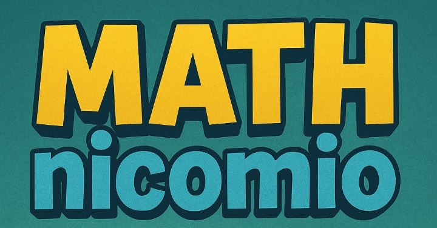
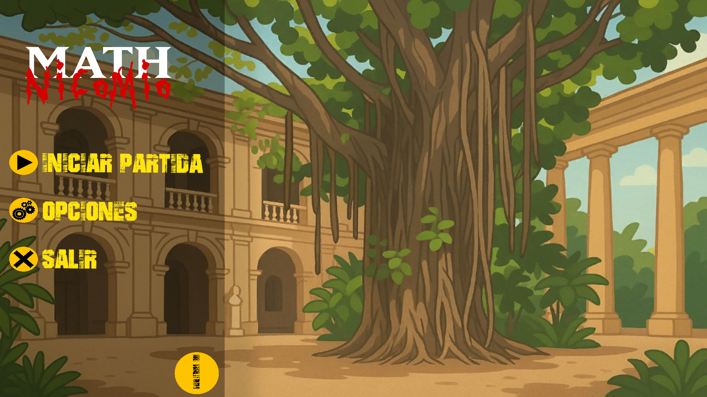
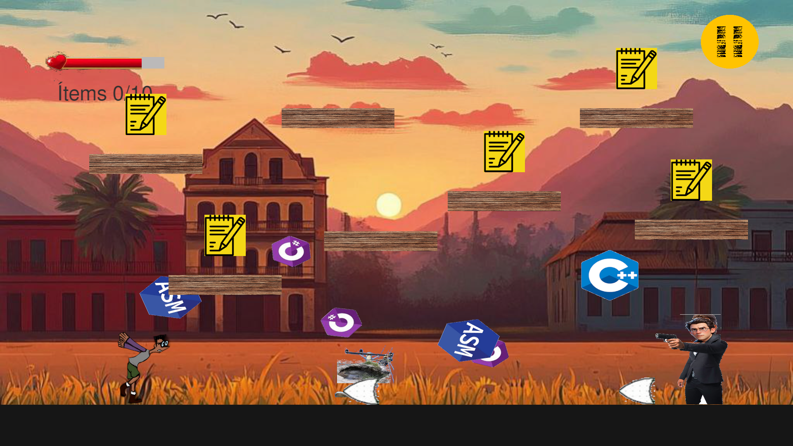

# 🎮 Mathnicomio: ¡Un viaje fuera de control! 🚀

**Bienvenido al repositorio oficial de Mathnicomio**, un videojuego plataformero desarrollado en Unity (versión 2022.3.6f1) para el **Matcom Game Festival** como parte de la **Jornada Científica**. 🎉

---

## 🕹️ Sobre el juego

En **Mathnicomio**, te pondrás en los zapatos de **Raimundo**, un estudiante que se quedó dormido y ahora debe correr contra el tiempo para entregar su proyecto en la facultad. Pero cuidado, ¡todo está fuera de control! 🌪️

### 🌟 Lógica del juego
- **Plataformas desafiantes**: Salta, esquiva y corre a través de niveles llenos de obstáculos impredecibles.
- **Mecánicas únicas**: Cada nivel presenta nuevos retos que pondrán a prueba tus reflejos y habilidades.
- **Historia inmersiva**: Vive la desesperación de Raimundo mientras intenta cumplir su misión en un mundo caótico.

---

## 📅 Contexto del proyecto

Este juego fue creado durante la **Game Jam de Matcom**, cuyo tema este año es **"Out of Control"**. Fue desarrollado en tiempo récord por un equipo apasionado, combinando creatividad, lógica y un toque de humor. 😄

---

## 🚀 Tecnologías utilizadas
- **Motor de juego**: Unity 2022.3.6f1
- **Lenguaje de programación**: C#

---

## 👥 Equipo: Tralalero Tralalá 🦈👟🎵

Este proyecto fue creado por el increíble equipo **Tralalero Tralalá**:

- [Anthony Cruz García](https://github.com/Anthonycg2003)
- Ernesto Javier Govea Varona
- [Kevin Marquez Vega](https://github.com/kevinator47)
- [Olivia Ortiz Arboláez](https://github.com/ViA8604)

---

## 📸 Capturas de pantalla

---

## 🤝 Contribuciones
¡Las contribuciones son bienvenidas! Si tienes ideas o encuentras algún problema, no dudes en abrir un issue o enviar un pull request. 💡

¡Gracias por visitar nuestro repositorio! 🎉 Esperamos que disfrutes jugando **Mathnicomio** tanto como nosotros disfrutamos creándolo. 🚀
